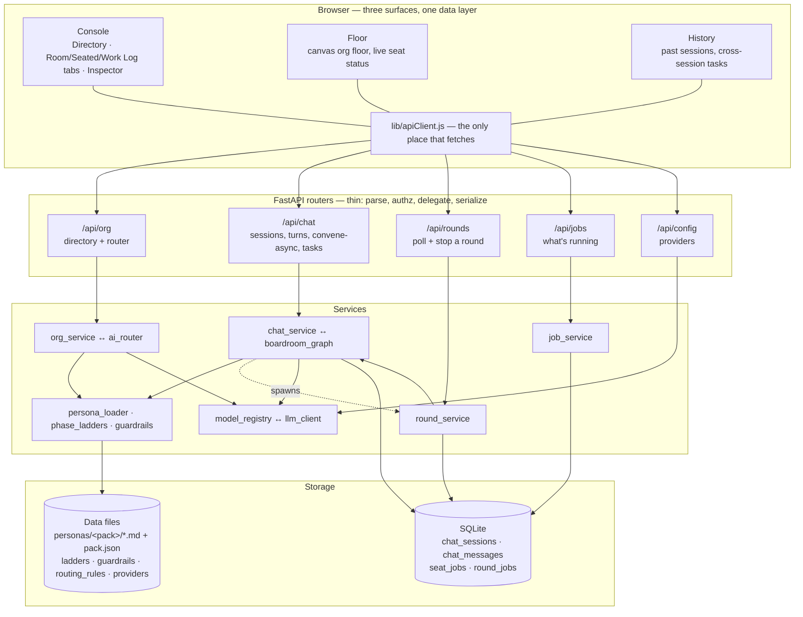
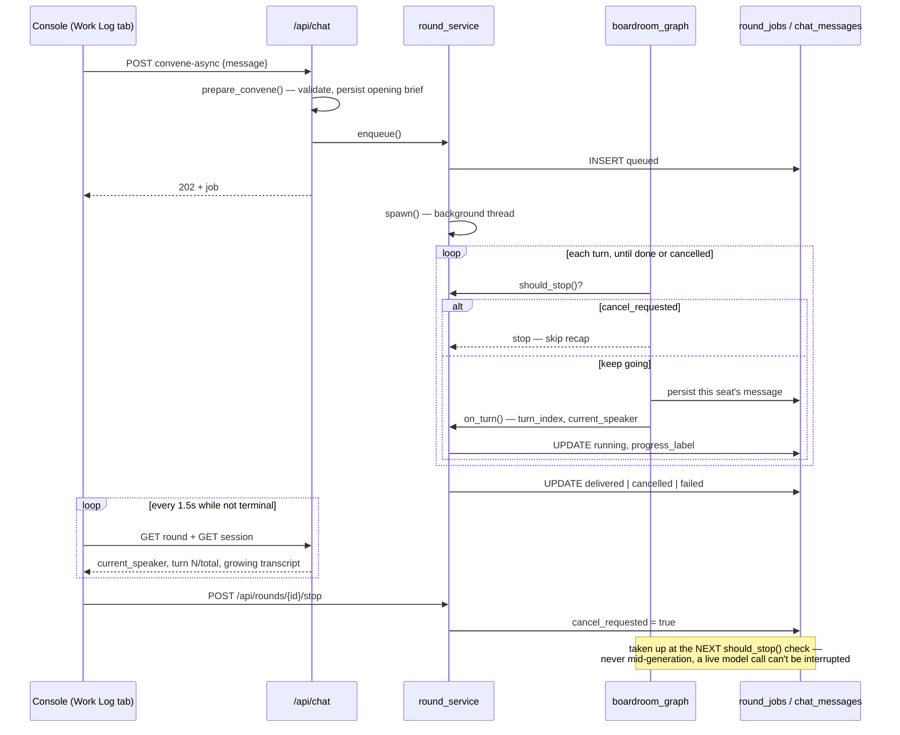

# Consilium — Architecture

How the system is put together, and **why** where the why is not obvious. Written
for someone about to change something.

---

## 0. The requirements behind the non-obvious engineering

Each of these produced a design choice that would otherwise look like
over-engineering. Each one is enforced by a test.

**R1 — The room must be explainable.** A summon returns the rules that fired
**and the text that fired them**. A user who gets a surprising room can see
why rather than re-rolling until it looks right. *Consequence:* the router is
deterministic keyword matching first — an LLM-only router would seat different
rooms for the same brief on different days, and nobody could distinguish a
roster change from model variance.

**R2 — The room must argue.** A room where nobody disagrees confirms what the
user already believes and bills them for it. The system detects declared
tension and reserves seat budget to introduce a dissenter when a room has none.

**R3 — Coverage where rules do not reach.** Rules cover the briefs somebody
thought of. When none match, an LLM picks from the roster — constrained to
real seat ids, validated against them, labelled `chosen_by: "ai"` so the path
taken is visible. The deterministic tension pass still runs on its output; the
model gets no say in who argues with whom.

**R4 — Cost must be knowable before it is spent.** Per-seat attribution, not a
blended number — otherwise the only lever a user has is "use fewer seats." The
quote follows the provider actually in use.

**R5 — Work must be observable while it happens.** The floor asks *what is
this person doing right now*. A row that exists only once work finishes cannot
answer that. Progress is persisted per step, and terminal states are
guaranteed even when the work explodes.

**R6 — Degradation must be visible.** Every fallback is stamped and surfaced:
an unresolvable guardrail policy shouts, an unreachable provider returns a
message marked `degraded` with the reason, a malformed manifest prints and
flags rather than loading an empty pack. The failure this prevents: the
original fallback returned a confident executive briefing about *"API
contracts and SOC 2 alignment"* — off-domain in a clinical session and
indistinguishable from a real advisor turn. A user acts on that believing a
specialist said it.

**R7 — Guardrails bind every seat**, not just the chair. An advisor without
the boundary can breach it on its own turn, and the chair only sees that
afterwards.

**R8 — A multi-turn debate must be watchable and stoppable.** Convening used
to be one blocking request: nothing was visible until every seat had spoken,
and nothing could be cancelled because the client had no handle on work still
running inside a request it was waiting on. A stop request is honoured
**between turns, never mid-generation** — a live model call is a blocking
network call with nothing to interrupt inside it short of killing the thread —
and it skips the chair's closing synthesis, since the user asked to stop and
nothing should spend one more call summarizing what was said.

**Non-goals**, stated once so scope decisions can point at them: not a
clinical decision support tool (§ guardrails, below); not a document
generator — the output is an argument, not a deliverable template; not a
replacement for counsel — regulatory/legal/actuarial seats raise the questions
a real advisor would, they do not answer them bindingly; not multi-tenant
SaaS yet — workspace scoping exists in the data model, authentication does not.

**Success criteria**, each enforced by a test rather than aspirational:

| | Measure |
| :--- | :--- |
| The roster earns its keep | ≥ 20 cross-pack tensions (currently 43) |
| Rooms are explainable | Every routing rule has a brief proving it fires |
| Rooms argue | Every routed brief produces a room with ≥ 1 declared tension |
| Prompts stay private | No system prompt in any directory response |
| Degradation is loud | Every fallback path stamps and surfaces its reason |
| Work is observable | Terminal state guaranteed on every job and every round |
| A debate is watchable and stoppable | A stop request always lands between turns and never runs the recap |

---

## 1. The shape



**The organising principle: what changes weekly is data, not code.** The roster,
the phase ladders, the guardrail policies, the routing rules, and the model
catalogue are all JSON or Markdown on disk. Adding a persona, a routing rule, or
a model is an edit to a file, not a deploy of new logic.

---

## 2. Personas and packs

`backend/app/personas/<pack>/*.md` + a `pack.json` manifest per pack.

```jsonc
{
  "id": "healthcare",
  "display_name": "Consilium Health",
  "phase_ladder": "clinical_program",
  "guardrails": "healthcare_v1",
  "inherits": ["moderator", "ceo", "finance", "ops"],
  "personas": [
    { "id": "vbc_retro", "name": "Risk Adjustment Specialist",
      "role": "Retrospective VBC, HCC Capture & RAF Accuracy",
      "tier": 4, "tags": ["healthcare", "vbc", "money", "data"],
      "conflicts_with": ["medical_coder", "health_economics", "healthcare_counsel"] }
  ]
}
```

`load_personas(["core", "healthcare"])` returns **one merged roster**, first-seen
wins on duplicate ids. That is why an inherited `ceo` keeps its core identity.

### Four contracts before you edit the loader

- **The golden roster.** `tests/golden_core_personas.json` pins the pre-pack core
  roster byte-for-byte. A deliberate change means regenerating the golden **in the
  same commit**, with the reason.
- **The 6-line parse window.** `Name:` / `Role:` / `Tone:` must appear within the
  first `META_SCAN_LINES` lines. Widening is safe; narrowing silently drops
  metadata into the generic-fallback path.
- **Conflicts must resolve.** A `conflicts_with` pointing at a nonexistent seat
  never fires, so a tension guard would silently under-report. Tested.
- **Degradation is observable.** A malformed `pack.json` prints and returns
  `degraded: True` rather than loading an empty pack.

### Tiers

| Tier | Meaning | Model |
| ---: | :--- | :--- |
| 0 | Chair | frontier |
| 1 | Executive | frontier |
| 2 | Functional | balanced |
| 4 | Domain specialist | balanced |

Tier 0–1 synthesize across the whole table; the rest argue from one discipline.
That is the split — not seniority theatre.

---

## 3. The org layer

`org_service.py` sits above the loader and below the API, and owns two things
the debate engine deliberately does not.

### The directory

`GET /api/org/seats` returns the roster **without system prompts**. 44 prompts is
roughly 120KB and the whole moat; none of it belongs in a browser payload. A test
asserts the omission.

### The router — a hybrid, and the order matters

```
brief ──▶ keyword rules (routing_rules.json)
            │ matched → chosen_by: "rules", with the matched text
            │ no match → LLM picks from the roster (ai_router.py)
            │              validated against real ids → chosen_by: "ai"
            │              nothing usable → chosen_by: "fallback"
            ▼
          deterministic tension pass ──▶ room
```

This is a **deterministic sandwich**: the non-deterministic step is bounded on
both sides by code, its output is validated against the roster, and the path
taken is reported. The model chooses *who is relevant*; it has no say over *who
argues*, because that is declared data.

Prompt-injection note: the brief is user text and goes in the **user** turn,
never concatenated into the system prompt. Tested.

### Two bugs this code carries scar tissue from

**`re.findall` returns capture groups** once a pattern has any, so every
alternative written outside a group (`risk.adjust`, `rna.?seq`) came back as an
empty string and its rule looked unmatched. That silently unseated the entire
clinical bench on the briefs it was written for. Use `finditer` and `group(0)`.

**Reserve the tension budget before slicing.** Rank → slice to cap → append a
dissenter puts the dissenter outside the cap. Rooms shipped agreeing while the
code claimed to prevent it. `TENSION_RESERVE` is held back from the ranking.

---

## 4. Ladders and guardrails

Both are **data keyed by id**, referenced from the pack manifest, resolved at
session construction.

| File | What |
| :--- | :--- |
| `ladders.json` | Phase ladders — `product_build`, `clinical_program`, `drug_development`, `research_program` |
| `guardrails.json` | Policies — `healthcare_v1`, `lifesciences_v1` |

A ladder is three phases plus a `focus_warning`. The original engine warned every
advisor off *"dev timelines or AWS choices"* in every session — nonsense in a
clinical debate, and the reason this is data now.

A guardrail policy carries `prompt_block`, `disclaimer`, and `moderator_addendum`.
One wording serves the prompt, the header, and the export so they cannot drift.

**Unknown ids degrade loudly.** An unresolvable guardrail policy prints
`THIS SESSION WILL RUN WITHOUT GUARDRAILS` and stamps `degraded`, because a
session that looks configured and is unprotected is the dangerous state.

### Where guardrails are actually injected

`ChatService._build_system_prompt` — the prompt every real turn uses.

Worth remembering: the injection used to live in `BoardroomGraphEngine`,
`ChatService` constructed one in `__init__`, and **never called it**. Every
healthcare turn ran unguarded while the guardrail tests passed, because those
tests drove the engine directly. Testing a seam production does not use is the
worst kind of green.

---

## 5. Sessions and the debate graph

### Roster bundles

`ChatSessionModel.persona_packs` (JSON, backfilled to `["core"]`) determines the
session's roster. `ChatService.roster_for(packs)` returns a cached, frozen
`RosterBundle`: personas, ladder, guardrails, allowed seat ids.

**The last pack in the list owns the ladder and the policy.** `["core",
"healthcare"]` runs the clinical ladder under healthcare guardrails while still
seating the C-suite. `CONSILIUM_PACKS` sets only the *default* for sessions that
do not declare their own.

> An empty `persona_packs` resolves to `["core"]` here — deliberately different
> from `org_service.normalize_packs([])`, which resolves to the whole org for
> browsing. Two correct defaults for the same "nothing specified" input, in two
> services that were never meant to agree on it; see the blueprint's
> `packsFor` note for the bug that seam produced and how it was closed on the
> frontend rather than by unifying the two.

The bundle is frozen because it is shared and cached; a turn that could mutate it
would be a cross-session bug.

### The graph

`boardroom_graph.py` is a compiled LangGraph `StateGraph`:

```
START ──▶ route ──▶ speak ──┬──▶ route   (seats remain, under cap)
                            ├──▶ recap   (multi-speaker round)
                            └──▶ END
```

**The graph owns control flow and nothing else.** Selecting, generating, and
persisting are injected callables, so the graph can be walked in a test with
three stubs — no database, no model, no network. Database writes inside graph
nodes would make a partially-walked graph leave half-written rows.

The single branch is arithmetic. An LLM deciding whether the debate continues
would make round length unpredictable and cost unquotable.

> **Recursion limit.** LangGraph defaults to 25 and each turn costs two node
> visits, so a ten-seat round would silently truncate. It is set explicitly.

This module was titled *"LangGraph Multi-Agent Boardroom Debate Engine"* for a
long time while importing nothing from LangGraph and never being invoked. There
is now a test that unwires it and goes red.

---

## 6. Providers

`providers.json` → `model_registry.py` → `llm_client.py`, all five providers
through LangChain's chat integrations.

| Provider | Key | Notes |
| :--- | :--- | :--- |
| Anthropic | `ANTHROPIC_API_KEY` | Opus 5 / Sonnet 5 / Haiku 4.5 |
| OpenAI | `OPENAI_API_KEY` | GPT-4.1 family |
| Google Gemini | `GOOGLE_API_KEY` | Gemini 2.5 |
| Groq | `GROQ_API_KEY` | Llama 3.3 |
| Ollama | — | Local, free |

Three rules:

- **`generate()` never raises.** A raising client turns one bad turn into a dead
  session. Failures return a string and set `last_result.degraded` with a reason,
  which `chat_service` stamps onto the message.
- **Keys never leave the process.** The settings API reports `has_key` as a
  boolean; there is deliberately no endpoint that reads one back.
- **Clients are cached** per `(provider, model, temperature, max_tokens, base_url)`
  and cleared on any settings change — a cached client outliving a provider
  switch means the change appears to do nothing.

Cost estimation reads the same catalogue, so the quote follows the provider
actually in use. It previously hardcoded Anthropic prices while the app could
only call Groq, quoting roughly ten times the real number.

---

## 6a. Observability

`generate_detailed` (`llm_client.py`) is the one place every provider call
passes through, so it is also the one place tracing lives — nothing depends on
`boardroom_graph.py`, `chat_service.py`, `orchestrator.py`, or `report_service.py`
remembering to instrument their own call. Each call, when Langfuse is
configured, becomes one Langfuse generation carrying the real prompt,
completion, model, token usage, and the same per-model price the cost
estimate above reads from — plus `node`/`session_id`/`persona_id`/`pack`
context the caller passes in, which is what groups a whole boardroom session
into one Langfuse session and answers "which stage is spending the money" on
the cost dashboard.

Two things this is deliberately not:

- **Not required.** No Langfuse keys configured means no tracing and an
  identical app — every Langfuse call in `llm_client.py` is wrapped so an
  outage or a bad host degrades to silence, never a failed turn.
- **Not a second copy of the same data.** `ChatMessageModel.message_meta`
  keeps a cost/usage summary and a link back to the Langfuse trace, not the
  prompt itself — the full generation lives in Langfuse, not duplicated into
  `consilium.db`.

Self-hosted only: the client (`app/services/langfuse_client.py`) refuses to
trace against Langfuse's cloud endpoint without an explicit host, and masks
prompts/completions (emails, SSNs, phone numbers, MRNs) before export via a
`mask` callable this repo defines — Langfuse's SDK provides the hook, not the
redaction logic. `./scripts/setup-langfuse.sh` stands up a local instance and
wires the keys in.

### General tracing, logs, and metrics (OTel → Tempo/Loki/Prometheus → Grafana)

Langfuse only sees LLM calls. A second, separate pipeline — `app/services/
telemetry.py` — covers everything else: HTTP requests (FastAPI
auto-instrumentation), SQL queries (SQLAlchemy), outbound calls (httpx), and
the RED metrics + domain metrics (LLM cost/tokens/duration) that come with
them. Without it, a slow response can only be attributed to "somewhere in the
request"; with it, the trace shows whether the time went to the database, an
external call, or the LLM. `./scripts/setup-tempo-grafana.sh` stands up the
whole stack — Collector → Tempo (traces), Prometheus (metrics), and Grafana
Alloy → Loki (logs), one Grafana serving all three datasources with
cross-links between them — and writes `OTEL_*` into `backend/.env`.

**Logs and traces are correlated, not just co-located.**
`TraceContextFilter` (`app/services/telemetry.py`, wired into
`setup_logging()` in `app/utils/logger.py`) stamps `trace_id`/`span_id` from
whatever OTel span is active onto every `LogRecord`. `OTelJsonFormatter`
already had slots for both fields — nothing populated them before this, so
every log line's `trace_id` was silently empty and Loki had nothing to link
to Tempo with. Alloy tails `logs/backend/backend.log` and
`logs/frontend/frontend.log` (not `backend_error.log` — that file duplicates
every ERROR line already in `backend.log`, from a second handler on the same
root logger), promotes `trace_id`/`span_id` to Loki structured metadata
(queryable, but not a label — an *indexed* label per distinct trace id would
be a cardinality explosion), and Grafana's datasources are wired both
directions: a log line's `derivedFields` jump to its trace
(`tempo-grafana/grafana/provisioning/datasources/datasources.yaml`), and a
trace's `tracesToLogsV2` jumps to its logs, filtered by `trace_id` rather
than a time-window guess.

**Background work needing its own root span (see below) is what makes this
worth having.** A log line from inside a boardroom round now carries the
*round's* trace id, not nothing — so "this round's advisor turn looks wrong"
resolves as one log-to-trace jump instead of grepping timestamps across two
systems by hand.

Setup-script note: `setup-tempo-grafana.sh` writes each config file only if
it's missing (`otel-collector.yaml`, `tempo-config.yaml`, `loki-config.yaml`,
`alloy-config.alloy`, `prometheus.yml`, `docker-compose.yml`) — hand edits
survive a re-run. `datasources.yaml` is the one exception, rewritten every
run since it's fully generated and never hand-edited; that's also what lets
adding a new datasource to an already-deployed install just be "run the
script again" rather than a manual migration. All services (Tempo, Loki,
Alloy, Prometheus, Grafana) live in one `docker-compose.yml` — Loki and
Prometheus were each added incrementally through a separate *additive*
overlay file at first (`docker compose -f x -f y -f z up -d`), which worked
but meant remembering an extra `-f` flag per addition; consolidated back into
one file once a third piece (Prometheus) made that genuinely annoying rather
than a one-time cost.

### Metrics specifically

RED metrics (rate, errors, duration) for HTTP and SQL come free once a
`MeterProvider` exists — the same FastAPI/httpx/SQLAlchemy instrumentors
`telemetry.py` already wires up for tracing accept a `meter_provider` kwarg
alongside `tracer_provider`, so nothing new needed instrumenting by hand.
Domain metrics — `llm.call.duration`, `llm.tokens`, `llm.cost.usd`,
`llm.calls` — live in `app/services/metrics.py`, emitted from the same
unconditional point in `generate_detailed` that already opens the `llm.call`
OTel span, so a Prometheus counter can never disagree with what Tempo or
Langfuse recorded for the same call. Cardinality is bounded on purpose: node
name, model, provider, `degraded` — never `session_id`/`persona_id`/`run_id`,
which belong on the span, not the metric.

**Exemplars close the loop the other direction**: a Prometheus data point
carries the exact `trace_id` of a request that contributed to it, so a spike
in a Grafana graph isn't just "something got slow at 3:04pm" — click the
point, land on the actual trace. Verified for real, not just "no errors":
`api/v1/query_exemplars` on a live `llm_call_duration_seconds_bucket` series
returned a `trace_id` that resolved with `GET /api/traces/{id}` → `200` in
Tempo.

**Process resource metrics (CPU/RAM/threads/GC) are in too**, via
`opentelemetry-instrumentation-system-metrics`, same pipeline, no new
infrastructure. Configured for `process.*`/`cpython.*` only (CPU%, RSS/virtual
memory, thread count, open file descriptors, GC generations) — deliberately
excluding `system.*` (whole-host CPU/RAM), which on a shared dev laptop would
answer "how busy is this laptop" rather than "is our backend using too much."
The config dict is derived from the library's own `_build_default_config()`
and filtered to the `process.`/`cpython.` prefix, not hand-written per key —
some keys need `None`, others need a list of sub-metric names
(`process.cpu.time` needs `["user", "system"]`; guessing `None` for every key
compiled fine but crashed the metric's collection callback at *export* time,
`'NoneType' object is not iterable`, with no indication of which key was
wrong). Deriving from the real default config sidesteps needing to know which
keys want what.

Two more bugs hit and fixed while wiring this up (the system-metrics config
bug above is a third), all worth knowing about before touching this again:

- **`enable_open_metrics: true` is a Collector exporter setting, not a
  Prometheus scrape-config field.** Copying it into `prometheus.yml`'s
  `scrape_configs` crash-looped Prometheus 3.x on startup: `field
  enable_open_metrics not found in type config.ScrapeConfig`. Exemplar
  support needs exactly two things — the Collector's prometheus exporter
  running with `enable_open_metrics: true`, and Prometheus itself started
  with `--enable-feature=exemplar-storage` — Prometheus then auto-negotiates
  OpenMetrics via the `Accept` header on its own; there's nothing to
  configure per scrape target.
- **The FastAPI instrumentor's HTTP metric is `http_server_duration_milliseconds`
  (older semantic convention, unit: milliseconds), not
  `http_server_request_duration_seconds`** — a plausible-sounding name that
  several docs and an earlier draft of `datasources.yaml` assumed, and that
  would have silently produced an empty panel with no error anywhere. Found
  by reading the actual scrape output (`curl localhost:8889/metrics`) rather
  than trusting the name — the same discipline the Langfuse SDK's API
  surface required earlier in this file. Re-verify against real scrape
  output before trusting either name on an instrumentation-library upgrade.

**`setup_telemetry(app, engine=...)` is called at module level in `main.py`,
immediately after `app = FastAPI(...)` — not inside `lifespan()`, and this
placement is load-bearing, not style.** `Starlette.__call__` builds and
*caches* `app.middleware_stack` on its very first invocation:

```python
async def __call__(self, scope, receive, send):
    if self.middleware_stack is None:
        self.middleware_stack = self.build_middleware_stack()
    await self.middleware_stack(scope, receive, send)
```

That first invocation is the ASGI **lifespan-startup** call itself — Starlette
doesn't special-case `scope["type"] == "lifespan"` before this check. If
`FastAPIInstrumentor.instrument_app()` (which patches
`app.build_middleware_stack`) runs from *inside* `lifespan()`'s body, the
patch always arrives too late: `middleware_stack` was already built from the
*unpatched* method as part of dispatching to `lifespan()` in the first place,
and it's never rebuilt afterward. The symptom was exactly this: `app.
_is_instrumented_by_opentelemetry` reads `True`, no exception is logged
anywhere, `FastAPIInstrumentor` genuinely runs — and yet zero HTTP spans ever
appear, for any request, silently. SQLAlchemy and httpx instrumentation are
unaffected (they patch their own libraries directly, independent of any
specific app's middleware stack), which is why DB/outbound spans could exist
while HTTP spans didn't, before this was fixed — a confusing half-working
state that looks like a sampling or config issue rather than an
initialization-order bug. `init_langfuse()` doesn't have this constraint (it
never touches `app.build_middleware_stack`), so it stays in `lifespan()`.

**The two pipelines share a trace id, not just a metadata pointer.**
`generate_detailed` opens the OTel span (`telemetry.span("llm.call", ...)`)
*before* starting the Langfuse generation. Langfuse's own SDK is OTel-based
internally, and when a valid OTel span is already active it joins that trace
rather than starting a new one — so the same hex trace id identifies the call
in both Tempo and Langfuse. Paste it into either tool's search.

One thing that looks like a bug and isn't: starting both pipelines logs
`WARNING opentelemetry.trace Overriding of current TracerProvider is not
allowed`. Langfuse's SDK claims the process-wide global `TracerProvider` first
(`init_langfuse()` runs in `lifespan()`, before the app ever handles a
request; `setup_telemetry()` has already run by then, at module level), and
OTel only allows that global to be set once. `telemetry.py` doesn't depend on
it: it keeps its own `_tracer_provider` reference and every instrumentor
(`FastAPIInstrumentor`, `HTTPXClientInstrumentor`, `SQLAlchemyInstrumentor`)
is passed that reference explicitly, so spans still export to Tempo
regardless of which provider is process-global. The warning is expected and
harmless — see the comment on `_tracer_provider` in `telemetry.py`.

**Background work gets an explicit root span, and this is not cosmetic.** A
newly spawned thread starts with *no* active OTel span, so every SQLAlchemy
operation inside it becomes its own single-span **root trace**. Left alone, a
few minutes of normal use buried Tempo under hundreds of one-span
`connect` / `SELECT` / `PRAGMA` traces — enough that an unfiltered `{}` search
returned *only* database noise and the `llm.call` traces were pushed past the
result limit entirely (they existed; they were simply never in the first 20
rows). The symptom reads as "my LLM traces aren't being recorded" when in fact
they were. `round_service.spawn`, `job_service.spawn`, and `main.py`'s startup
sequence each wrap their work in one `telemetry.span(...)`, so a round is one
trace with its seat turns and queries nested underneath. Measured on a reload:
20 spans under a single `startup` root, versus 19 separate root traces before.
Any new background thread or scheduled task needs the same treatment.

Two operational gotchas worth knowing before assuming something's broken:

- **Tempo's `/api/search` with no explicit `start`/`end` doesn't reliably
  include "just now".** Pass an explicit time range
  (`?start={unix}&end={unix}`) when checking whether a trace you just
  produced actually arrived — an unfiltered query with only `limit` can come
  back empty or stale even though the trace exists.
- **The Collector's tail-sampling `baseline` policy is 100% for this local
  stack** (`scripts/setup-tempo-grafana.sh`), deliberately — a lower
  percentage (the usual production default) means most individual traces get
  dropped by design, which looks identical to "tracing is broken" on a
  single-developer machine. Lower it if this stack ever serves more than one
  developer's traffic.
- **Pipeline latency is tuned for "still looking at the screen," not
  production efficiency.** The OTel SDK default (`BatchSpanProcessor`
  `schedule_delay_millis=5000`) stacked with the Collector's own
  `tail_sampling.decision_wait: 10s` and `batch.timeout: 5s` added up to a
  trace taking 20-40s to become searchable — long enough that "I can't find
  the trace I just made" reads as broken tracing rather than pending
  batches. `telemetry.py` uses `schedule_delay_millis=500`; the Collector
  uses `decision_wait: 2s` and `batch.timeout: 500ms`. Measured end-to-end
  after tuning: ~5s from request to searchable. This tradeoff (slightly more,
  smaller export calls) is free locally and would be worth reconsidering
  only if this stack ever carries real production volume.

Verified end-to-end (not just "containers are up"): a real call through
`generate_detailed` produced a trace queryable from both
`GET localhost:3200/api/traces/{id}` (Tempo) and
`GET localhost:3000/api/public/v2/observations?...` (Langfuse) with the
identical trace id, matching `session_id`, and the `llm.call` span carrying
`langfuse.trace.id`/`langfuse.trace.url` attributes. Separately, after fixing
the module-level instrumentation ordering: `GET /api/jobs` (a real,
DB-touching endpoint) produced one coherent trace with `connect` and
`SELECT ./consilium.db` spans correctly nested as children of the HTTP root
span — confirming the "was it the database or the LLM" question this
pipeline exists to answer is actually answerable now, not just that spans
exist somewhere.

---

## 7. Async seat work

`job_service.py` + `seat_jobs`. The floor asks *what is this person doing right
now*, and a row that exists only once work finishes cannot answer that.

```
POST /assign-async ──▶ validate ──▶ enqueue (queued) ──▶ 202 + job id
                                        │
                                   thread: running → progress_label → …
                                        │
                                   delivered | failed   (always one of these)
                                        │
GET /api/jobs ◀── poll every 2.5s ──────┘
```

Three properties, and the first is the whole point:

- **Terminal states are guaranteed.** The exception path finalizes the row as
  `failed` with the error class *before* re-raising. A job dying without
  finalizing leaves a desk thinking forever about work that ended ten minutes ago.
- **A restart reaps orphans.** Threads do not survive a process exit, so anything
  still `queued`/`running` at boot is failed as `ServerRestart`.
- **Validation runs before enqueueing.** A job row for work that was never going
  to be accepted is a permanently failed desk plus a confusing error one poll
  later.

Threads rather than a task queue: adding Redis and a worker process to run four
LLM calls is not a trade this earns yet. **The swap point is `job_service.spawn`
and nowhere else.**

---

## 7a. Async rounds — "Convene the board" without blocking

`round_service.py` + `round_jobs`, plus a `should_stop` hook threaded through
`boardroom_graph`'s `route` node. Same shape as async seat work, for a
different unit of work: a round is not one seat's output, it is the whole
debate, so `RoundJobModel` tracks `current_speaker`, `turn_index`, and a
`cancel_requested` flag instead of one `progress_label`.

Convening used to be one blocking request — nothing was visible until every
seat had spoken, and nothing could be stopped, because the client had no
handle on work that only existed inside a request it was still waiting on.



The extraction that made this possible: the automatic-round logic used to live
inline in `_generate_agent_replies`. It is now `ChatService._run_automatic_round`,
taking optional `should_stop`/`on_turn` callables. The synchronous "Convene the
board" call site passes neither — unchanged behaviour, unchanged tests;
`run_convene_round` (the background-thread path) passes both.

Two bugs this carries scar tissue from:

- **Wrong router mount.** The stop endpoint was first written inside the chat
  router, so it silently resolved to `/api/chat/rounds/{id}/stop` instead of
  `/api/rounds/{id}/stop`. A live smoke test caught it; the unit tests did not,
  because the endpoint existed and returned *something* — just not at the path
  the frontend called. `POST /api/chat/sessions/{id}/convene-async` legitimately
  lives under `/api/chat` (it needs the session and the opening brief); polling
  and stopping only need a `job_id`, so they got their own router.
- **A polling effect that depended on the state it wrote.** The frontend's poll
  loop originally read `useEffect(() => {...; setRoundJob(job)}, [roundJob])`.
  Every tick's `setRoundJob` retriggered the effect, tearing down and rebuilding
  the interval on every poll instead of pacing it — firing back-to-back rather
  than every 1.5s. Fixed by depending on `roundJob?.id` (stable for the life of
  one round) instead of the object.

---

## 7b. History

Sessions, transcripts, and tasks were persisted from the beginning — nothing in
the console read them back, so a refresh was indistinguishable from a delete.

`chat_service.list_tasks()` flattens `action_items` across sessions, because the
question people ask afterwards (*"what did I ask for, and did I get it?"*) spans
sessions and cannot be answered from inside one. Each row carries its session's
title and id so it stands alone when read outside that session.

**`delivered` is derived from `message_id`, never from a status field.** A flag
can disagree with reality; a link to the message that fulfilled the task cannot.

Owner names resolve through the *session's* roster bundle, not the process
default — otherwise a clinical seat in a core-default deployment would render as
a raw id.

The browser stores only the last session **id**. Caching the transcript would let
a stale copy outlive the real one, which is precisely what makes people stop
trusting a history view.

---

## 8. Frontend

```
src/
  App.jsx                 state, data loading, surface switch, tab bar, convene/stop/continue
  lib/apiClient.js         ONE data layer — base URL, errors, all endpoints
  console/
    Directory.jsx          44 seats by tier, search + tags
    Room.jsx               two tab BODIES (Room controls, Seated info) — no shell of its own
    WorkLog.jsx             transcript, task table, targeted composer — the third tab body
    Inspector.jsx          dossier, conflicts both directions
    AssignTask.jsx         assignment modal
    Settings.jsx           provider, model, key, test connection
    History.jsx            past sessions + cross-session tasks, two sub-tabs
    Floor.jsx              canvas floor + DOM seat layer
    floorLayout.js         all floor geometry — pure functions
    console.css            tokens, both themes, floor styles, tab bar
```

**One data layer.** Every call goes through `apiClient.js`. No component fetches.

**Server data is not app state.** Fetch, render, refetch. The only real client
state is the selection, the brief, and which seat is inspected.

### The middle panel is tabs, not a split

Room / Seated / Work Log used to share one column via a fixed vertical split
(52/48, later 58/42 chasing the same bug). Whichever way that split was cut,
the two sides competed for one constrained height: the brief-form and readout
alone could consume Room's entire share, squeezing the "Seated" grid — the
actual point of that pane — to a sliver underneath it. Fixing the split ratio
only moved the squeeze around; it never removed the competition.

Tabs remove the competition instead of rebalancing it. `App.jsx` owns the tab
bar and renders `<Room activeTab={middleTab} .../>` and `<WorkLog/>` as
siblings inside one shared `.pane` shell; **Room.jsx no longer renders its own
pane chrome** — it returns two `.tab-panel` bodies (`room`, `seated`) shown or
hidden with CSS (`display:none` / `.is-active`), never unmounted, so switching
tabs does not reset scroll position or in-progress local state. Whichever tab
is active gets the pane's *entire* height.

Switching is automatic where it matters, so the user is not stuck clicking
tabs to follow along: Summon → **Seated**; Convene, Send, Talk-to, Assign,
Synthesize → **Work Log**.

**Convene / Stop / Continue lives in the tab bar, not inside the Room tab.**
One button, three states, pushed to the right of the row (`.tab-bar-spacer`)
so it reads as the panel's primary action rather than a fourth tab:

| State | Condition | Calls |
| :--- | :--- | :--- |
| Convene the board | no round yet for this session | `handleDispatch` (creates the session, `POST convene-async`) |
| Stop the debate | `roundJob` exists and is not terminal | `handleStop` (`POST /api/rounds/{id}/stop`) |
| Continue the discussion | `roundJob` exists and is terminal | `handleContinue` — a **new** round on the same session, not a resume; `round_service` has no concept of picking a finished round back up mid-flight |

Hidden entirely during a one-on-one (`oneOnOne` truthy): those sessions use
`turn_mode: manual` and `handleSend`, not the automatic-round machinery this
button drives.

### The floor

**Canvas for the floor, DOM for the people.** Platforms and desks are generated
geometry and belong on a canvas; every name and status is a real `<button>`
positioned over it. A pure-canvas floor is invisible to a screen reader,
unfocusable by keyboard, and its text cannot be selected.

**Geometry lives in `floorLayout.js`** — pure functions, no rendering context, so
the part most likely to be wrong can be checked directly.

Three numbers that are coupled, and breaking the coupling is the bug:

| | |
| :--- | :--- |
| `TILE_W = 264` | nearest desks land 132px apart horizontally |
| card `max-width: 124px` | must clear that gap — the first version used `TILE_W = 96`, putting neighbours 48px apart under 148px cards, so every card overlapped |
| `DETAIL` thresholds | below 0.45 the cards hide and canvas markers carry the floor |

**It does not open on fit-everything.** 44 seats fitted to a laptop pane lands
around 0.34, below the legibility threshold — the first thing you would see is
forty anonymous dots. It opens at a readable zoom, centred, with Fit on demand.

**Motion means something or it does not happen.** A desk pulses because that seat
has a *running job row*. Ambient animation everywhere would bury the one signal
the view exists for. `prefers-reduced-motion` turns the pulse into a static ring.

---

## 9. API surface

| | |
| :--- | :--- |
| `GET /api/org/packs` | packs, ladders, guardrail policies, seat counts |
| `GET /api/org/seats?packs=&tag=&q=` | the directory — never returns prompts |
| `GET /api/org/seats/{id}` | dossier, conflicts both directions |
| `POST /api/org/summon` | room + the rules that fired + cost + tensions |
| `POST /api/org/tensions` | disagreements for a hand-picked room |
| `POST /api/chat/sessions` | create, with `persona_packs` |
| `POST /api/chat/sessions/{id}/messages` | a turn; `agent_id` targets one seat |
| `POST /api/chat/sessions/{id}/synthesize` | chair briefing |
| `POST /api/chat/sessions/{id}/assign` | assign + deliverable, synchronous |
| `POST /api/chat/sessions/{id}/assign-async` | 202 + a job to watch |
| `POST /api/chat/sessions/{id}/convene-async` | 202 + a round to watch; validates and persists the opening brief before enqueueing |
| `GET /api/chat/sessions/{id}/round` | the most recent round for this session, so a reload can find it |
| `GET /api/rounds/{job_id}` | poll one round — `current_speaker`, `turn_index`/`turn_total`, status |
| `POST /api/rounds/{job_id}/stop` | flag a round to stop after the current speaker finishes |
| `GET /api/chat/sessions?limit=` | past sessions, most recently touched first |
| `GET /api/chat/tasks?state=` | every task across sessions, `all`/`delivered`/`outstanding` |
| `GET /api/jobs?active_only=` | what every seat is doing |
| `GET /POST /api/config` | provider catalogue and selection |
| `POST /api/config/test` | a real round trip, not a key check |

Routers are thin — parse, authz, delegate, serialize. Logic lives in services.

---

## 10. Testing

```sh
cd backend && PYTHONPATH=. .venv/bin/python -m pytest tests/ -q
```

**268 passing, nothing excluded, under two seconds.**

`tests/conftest.py` **blanks every provider credential for the whole suite.** Two
reasons, and the second is the one that bit: the degraded paths are what ship to
anyone without a key and should be exercised by default; and without it any test
touching the LLM path picks up `.env` and makes **real network calls**. That is
what the long-standing "`test_chat_service.py` hangs, inherited from upstream"
note actually was. It was never a hang.

Tests are **data-driven**: adding a pack means updating `DOMAIN_PACKS`, adding a
routing rule means adding a brief to `ROUTING_CASES`. A rule with no brief proving
it fires fails the suite.

---

Usage: [`usage.md`](usage.md) ·
Build guidance: `.agents/skills/engineering/` (local only, gitignored — not in the pushed repo)
